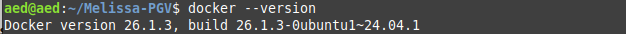
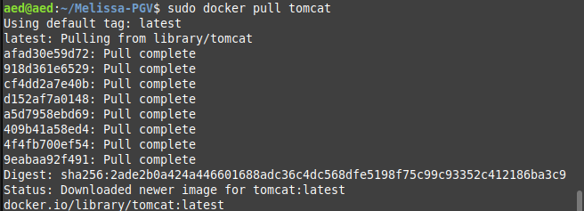
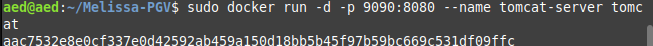
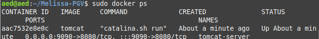
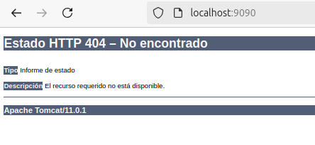
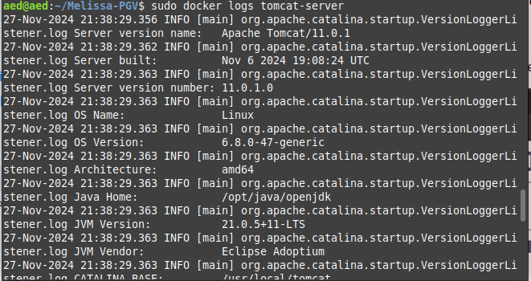
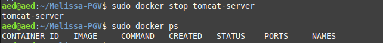

# Tarea 2.  Instalación de Apache Tomcat en Docker con un Puerto Específico

Este proyecto guía la instalación y configuración de Apache Tomcat en un contenedor Docker, asignando un puerto específico para su acceso desde la máquina anfitriona.

## Índice

1. [Objetivo](#objetivo)
2. [Requisitos Previos](#requisitos-previos)
3. [Pasos de Instalación](#pasos-de-instalación)
   - [1. Verificar Docker](#1-verificar-docker)
   - [2. Descargar imagen de Tomcat](#2-descargar-imagen-de-tomcat)
   - [3. Ejecutar el contenedor](#3-ejecutar-el-contenedor)
   - [4. Probar configuración](#4-probar-configuración)
   - [5. Detener imagen](#5-detener-imagen)
4. [Reto Adicional](#reto-adicional)


---

## Objetivo

Configurar un contenedor Docker que ejecute Apache Tomcat y que esté accesible desde un puerto específico en la máquina anfitriona.

---

## Requisitos Previos

- Docker instalado en la máquina anfitriona.
- Un puerto libre para asignar a Tomcat (por defecto, se usará el 9090).

---

## Pasos de Instalación

### 1. Verificar Docker
1. Confirmamos que Docker está instalado y funcionando:
   ```bash
   docker --version

  

2. Aseguramos de que el puerto  (por ejemplo, 9090) está libre:  
```bash
lsof -i :9090
```
Yo lo tengo libre así que continuamos:

### 2. Descargar imagen de Tomcat  
```bash
sudo docker pull tomcat
```

Verificamos que la imagen fue descargada correctamente:  
```bash
docker images
```


### 3. Ejecutar el contenedor
Iniciamos un contenedor de Tomcat mapeando el puerto 8080 del contenedor al puerto 9090:  
```bash
docker run -d -p 9090:8080 --name tomcat-server tomcat
```  
  
Verificamos que el contenedor esté en ejecución con 
```
docker ps
```


#### 4. Probamos configuración  
Abrimos el navegador y accedemos a 
http://localhost:9090  


miramos los logs con 
```
docker logs tomcat-server
```
  
### 5. Detener imagen
Detenemos contenedor:
```
docker stop tomcat-server
```


Si deseamos eliminar la imagen tom cat del sistema usamos:
```
docker rmi tomcat
```

### Reto adicional
Iniciamos otro contenedor en un puerto diferente
```
docker run -d -p 7070:8080 --name tomcat-alt tomcat
```
Persistir Datos con un Volumen Docker:

Mapea un directorio local al contenedor:
```
docker run -d -p 9090:8080 --name tomcat-server -v /ruta/local:/usr/local/tomcat tomcat
```
Esto permite que las configuraciones de Tomcat sean persistentes.