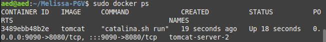
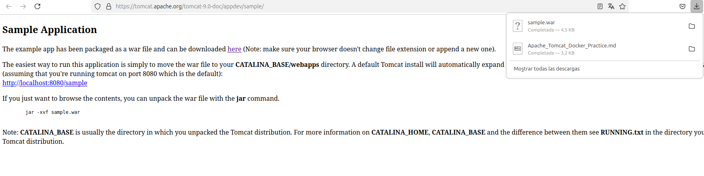
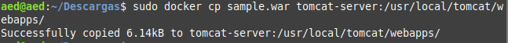
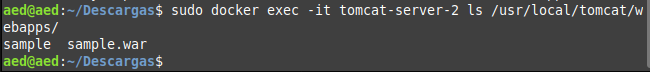
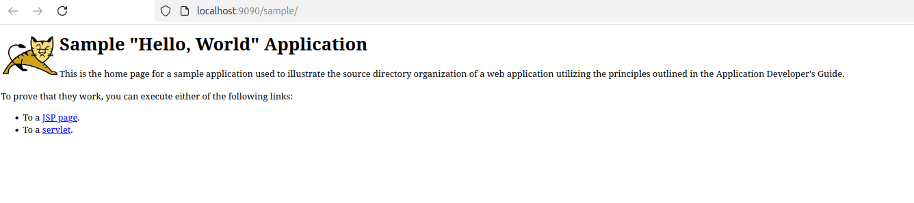

# Índice

1. [**Descargar e iniciar Apache Tomcat en Docker**](#1-descargar-e-iniciar-apache-tomcat-en-docker)
   - [1.1. Ejecutar Apache Tomcat en un contenedor Docker](#1.1-ejecutar-apache-tomcat-en-un-contenedor-docker)  
   - [1.2. Verificar que el contenedor esté corriendo](#1.2-verificar-que-el-contenedor-esté-corriendo)

2. [**Descargar una aplicación .war de ejemplo**](#2-descargar-una-aplicación-war-de-ejemplo)
   - [2.1. Descargar `sample.war` desde el sitio oficial de Apache Tomcat](#21-descargar-samplewar-desde-el-sitio-oficial-de-apache-tomcat)

3. [**Copiar el archivo .war al contenedor**](#3-copiar-el-archivo-war-al-contenedor)
   - [3.1. Usar el comando `docker cp` para copiar el archivo](#3.1-usar-el-comando-docker-cp-para-copiar-el-archivo)
   - [3.2. Confirmar que el archivo fue copiado correctamente](#3.2-confirmar-que-el-archivo-fue-copiado-correctamente)

4. [**Acceder a la aplicación**](#4-acceder-a-la-aplicación)
   - [4.1. Verificar el despliegue automático de Tomcat](#4.1-verificar-el-despliegue-automático-de-tomcat)
   - [4.2. Acceder a la aplicación en el navegador](#4.2-acceder-a-la-aplicación-en-el-navegador)

5. [**Verificar logs en caso de problemas**](#5-verificar-logs-en-caso-de-problemas)
   - [5.1. Inspeccionar los logs del contenedor para identificar errores](#5.1-inspeccionar-los-logs-del-contenedor-para-identificar-errores)

6. [**Obtener la IP del contenedor**](#6-obtener-la-ip-del-contenedor)
   - [6.1. Usar `docker inspect` para encontrar la IP del contenedor](#6.1-usar-docker-inspect-para-encontrar-la-ip-del-contenedor)
   - [6.2. Acceder a la aplicación usando la IP del contenedor](#6.2-acceder-a-la-aplicación-usando-la-ip-del-contenedor)

7. [**Resumen**](#7-resumen)


# Instalación de Apache Tomcat en Docker con un Puerto Específico

## **1. Descargar e iniciar Apache Tomcat en Docker**
1. Ejecutamos Apache TomCat:
   ```bash
   docker run -d -p 9090:8080 --name tomcat-server tomcat
   ```
   - `-d`: Ejecuta el contenedor en segundo plano.
   - `-p 9090:8080`: Mapea el puerto 8080 del contenedor al puerto 9090 de tu máquina.
   - `--name tomcat-server`: Asigna un nombre al contenedor.

3. Verificamos que el contenedor esté corriendo:
   ```bash
   docker ps
   ```
   

---

## **2. Descargar una aplicación .war de ejemplo**
1. Visitamos el sitio oficial de Apache Tomcat y descargamos la aplicación de ejemplo `sample.war` desde [este enlace](https://tomcat.apache.org/tomcat-9.0-doc/appdev/sample/).


---

## **3. Copiar el archivo .war al contenedor**
1. Usamos el comando `docker cp` para copiar el archivo .war al directorio `webapps` de Tomcat dentro del contenedor:
   ```bash
   docker cp /ruta/a/sample.war tomcat-server:/usr/local/tomcat/webapps/
   ```
   
   - Reemplazamos `/ruta/a/sample.war` con la ruta real donde descargamos el archivo.
   - `tomcat-server` es el nombre del contenedor (puedes usar el `CONTAINER ID` si no nombraste el contenedor).

2. Confirmamos que el archivo fue copiado:
   ```bash
   docker exec -it tomcat-server ls /usr/local/tomcat/webapps/
   ```
   Deberiamos ver el archivo `sample.war` en la lista.
   

---

## **4. Acceder a la aplicación**
1. Una vez que el archivo .war esté copiado, Tomcat lo desplegará automáticamente. Esto puede tardar unos segundos.
2. Accedemos a la aplicación usando tu navegador web:
   ```
   http://localhost:9090/sample
   ```
   Si todo está funcionando correctamente, se debe ver esto:
   

---

## **5. Verificar logs en caso de problemas**
1. Si no puedes acceder a la aplicación o no se despliega, revisa los logs del contenedor para identificar problemas:
   ```bash
   docker logs -f tomcat-server
   ```
   Busca mensajes relacionados con errores de despliegue o configuraciones.

---

## **6. Obtener la IP del contenedor**
1. Si tienes problemas de conectividad usando `localhost`, obtén la IP del contenedor:
   ```bash
   docker inspect tomcat-server
   ```
2. Busca el campo `IPAddress` en la salida y accede a la aplicación usando esa IP:
   ```
   http://<IP_DEL_CONTENEDOR>:9090/sample
   ```

---

## **Resumen**
- Iniciaste Apache Tomcat en Docker con un puerto específico.
- Descargaste una aplicación .war de ejemplo.
- Copiaste el archivo al contenedor y accediste a la aplicación a través del navegador.
- Verificaste los logs y usaste herramientas de inspección en caso de problemas.
