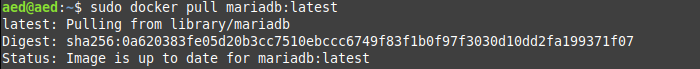
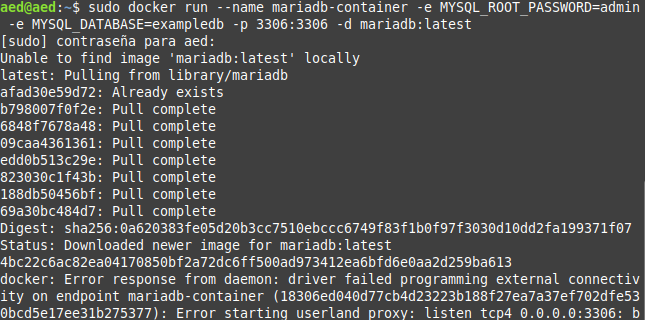
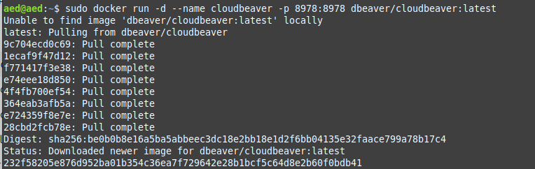
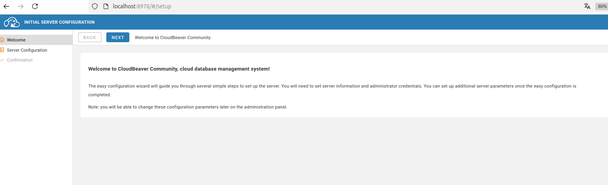
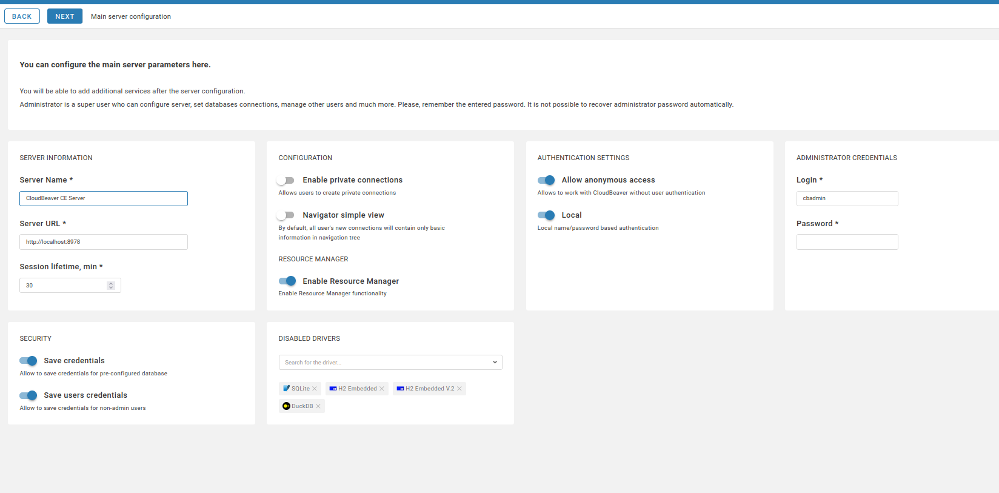

# Instalación de MariaDB y Cliente de Base de Datos en Docker

## Objetivo
Aprender a instalar y configurar una base de datos MariaDB dentro de un contenedor Docker, junto con un cliente de base de datos (CloudBeaver) para interactuar con ella.

---

## Prerrequisitos
- Tener Docker instalado y en funcionamiento.
- Verificar que Docker está corriendo:
  ```bash
  docker -v
  docker ps
  ```

---

## Instalación y Configuración de MariaDB en Docker

### 1. Descargar e iniciar un contenedor MariaDB
Descargamos con
```
sudo docker pull mariadb:latest
```

Ejecutamos el siguiente comando para descargar la imagen de MariaDB y crear un contenedor:
```bash
docker run --name mariadb-container -e MYSQL_ROOT_PASSWORD=admin -e MYSQL_DATABASE=exampledb -p 3306:3306 -d mariadb:latest
```


#### Explicación de los parámetros:
- `docker run`: Crea y ejecuta un contenedor.
- `--name mariadb-container`: Asigna el nombre `mariadb-container` al contenedor.
- `-e MYSQL_ROOT_PASSWORD=admin`: Configura la contraseña del usuario root como `admin`.
- `-e MYSQL_DATABASE=exampledb`: Crea una base de datos inicial llamada `exampledb`.
- `-p 3306:3306`: Mapea el puerto 3306 del contenedor al puerto 3306 del host.
- `-d`: Ejecuta el contenedor en modo "detached" (segundo plano).
- `mariadb:latest`: Especifica la imagen de MariaDB más reciente.

---

### 2. Verificar que el contenedor esté corriendo
Listar los contenedores en ejecución:
```bash
docker ps
```
Para listar todos los contenedores (activos e inactivos):
```bash
docker ps -a
```


---

### 3. Verificar los logs del contenedor
En caso de problemas, consulta los logs del contenedor:
```bash
docker logs -f mariadb-container
```

---

### 4. Obtener información del contenedor
Inspecciona el contenedor para obtener detalles como la dirección IP:
```bash
docker inspect mariadb-container
```

---

## Instalación de CloudBeaver como cliente de base de datos

### 1. Descargar y ejecutar CloudBeaver
Ejecuta el siguiente comando para iniciar un contenedor de CloudBeaver:
```bash
docker run -d --name cloudbeaver -p 8978:8978 dbeaver/cloudbeaver:latest
```


#### Explicación de los parámetros:
- `docker run`: Crea y ejecuta un nuevo contenedor.
- `-d`: Ejecuta el contenedor en modo "detached".
- `--name cloudbeaver`: Asigna el nombre `cloudbeaver` al contenedor.
- `-p 8978:8978`: Mapea el puerto 8978 del contenedor al puerto 8978 del host.
- `dbeaver/cloudbeaver:latest`: Usa la última versión de CloudBeaver.

---

### 2. Verificar que el contenedor esté corriendo
Lista los contenedores:
```bash
docker ps -a
```

#### Ejemplo de salida esperada:
```
CONTAINER ID   IMAGE                          COMMAND           CREATED          STATUS         PORTS                    NAMES
53fdfab55937   dbeaver/cloudbeaver:latest     "./run-server…"   38 seconds ago   Up 37 seconds  0.0.0.0:8978->8978/tcp   cloudbeaver
```

---

### 3. Acceder a CloudBeaver
- Abre un navegador web.
- Navega a `http://localhost:8978`.
- Sigue las instrucciones de configuración inicial.


---

## Conexión a MariaDB desde CloudBeaver

### 1. Crear una conexión a MariaDB
- Hacemos clic en `New Connection` (Nueva conexión).
- Selecciona `MariaDB/MySQL` como tipo de base de datos.
- Introduce los siguientes datos de conexión:
  - **Host:** Dirección IP del contenedor (obtenida con `docker inspect`).
  - **Puerto:** `3307` (el puerto configurado para MariaDB).
  - **Usuario:** `root` (u otro usuario configurado).
  - **Contraseña:** `admin` (o la contraseña configurada).
  - **Base de datos:** `exampledb` (o el nombre de la base de datos configurada).

### 2. Verificar conexión
- Haz clic en `Test Connection` para comprobar la conexión.
- Si es exitosa, haz clic en `Finish`.

---

## Detener y eliminar contenedores

### 1. Detener contenedores
Para detener un contenedor:
```bash
docker stop mariadb-container
docker stop cloudbeaver
```

### 2. Eliminar contenedores
Para eliminar un contenedor:
```bash
docker rm mariadb-container
docker rm cloudbeaver
```

---

## Notas finales
Con esta práctica, has aprendido a configurar una base de datos MariaDB y gestionar su contenido utilizando un cliente gráfico (CloudBeaver) en Docker.