## Objetivo

Conectar una Base de Datos NoSQL con un Cliente de Base de Datos.

Consulta los comandos de docker en el siguiente [enlace](https://github.com/jpexposito/code-learn/blob/main/comun/docker/COMANDOS.md), y las redes en docker en el siguiente [enlace](https://github.com/jpexposito/code-learn/tree/main/comun/docker/ud-5).

> Recuerda que debes de tener docker corriendo

```bash
docker -version
docker ps
```

---

## Volúmenes en Docker

En `Docker`, un **volumen** es un mecanismo para almacenar y compartir datos entre contenedores o entre el host y los contenedores. Los `volúmenes` son administrados por Docker y permiten persistir datos incluso si el contenedor es eliminado. Esto es útil para mantener datos importantes, como bases de datos, configuraciones o cualquier otro archivo que necesite persistencia.

**Ventajas de usar volúmenes:**

1. Persistencia: Los datos no se pierden cuando el contenedor se detiene o elimina.
2. Compartición: Permiten compartir datos entre varios contenedores.
3. Flexibilidad: Docker administra los volúmenes, asegurando un almacenamiento eficiente y una fácil gestión.

---

## Redes disponibles

Lista el conjunto de redes disponibles en este momento.

```bash
docker network ls
```

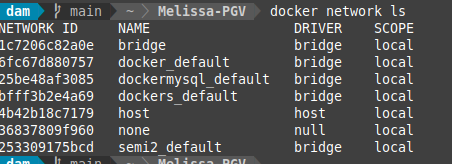


## Pasos del Ejercicio

### Crear una Red Personalizada

Ejecuta el siguiente comando para crear una red llamada `mongodb-network`:

```bash
docker network create mongodb-network
```

Ejecuta `docker network ls`, y muestra las redes disponibles en `docker`.

### Crear un Volumen para MongoDB

Ejecuta el siguiente comando para crear un volumen llamado mongodb-data:

```bash
docker volume create mongodb-data
```

Lo creamos y comprobamos listando que la tenemos:  

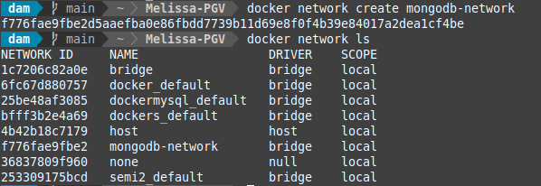

> ***Esto permitirá que los datos de MongoDB persistan incluso si el contenedor se elimina***.


Ejecuta `docker volume ls`, y muestra el resultado:

```bash
docker volume ls
```

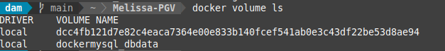

### Levantar el Contenedor MongoDB

Usa el siguiente comando para ejecutar MongoDB con el volumen y la red configurados:

```bash
docker run -d --name mongodb-container \
  --network mongodb-network \
  -e MONGO_INITDB_ROOT_USERNAME=admin \
  -e MONGO_INITDB_ROOT_PASSWORD=admin123 \
  -v mongodb-data:/data/db \
  -p 27017:27017 \
  mongo:latest
```
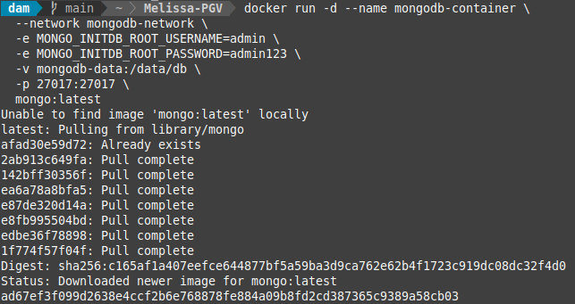

Explicación de los parámetros:

- `--network mongodb-network`: Conecta el contenedor a la red personalizada.
- `-v mongodb-data:/data/db`: Asocia el volumen mongodb-data al directorio `/data/db`, que es donde `MongoDB` almacena sus datos.


### Levantar el Contenedor Mongo Express

Mongo Express es un cliente web para gestionar MongoDB. Usa este comando para levantar el contenedor:

```bash
docker run -d --name mongo-express-container \
  --network mongodb-network \
  -e ME_CONFIG_MONGODB_ADMINUSERNAME=admin \
  -e ME_CONFIG_MONGODB_ADMINPASSWORD=admin123 \
  -e ME_CONFIG_MONGODB_SERVER=mongodb-container \
  -p 8081:8081 \
  mongo-express:latest
```

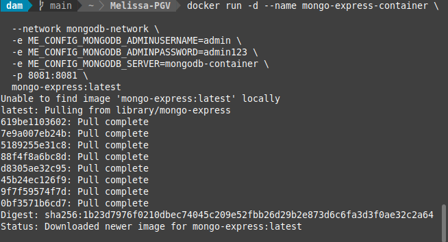

Explicación de los parámetros:

- `--network mongodb-network`: Conecta el contenedor a la misma red que `MongoDB`.
- `-e ME_CONFIG_MONGODB_SERVER=mongodb-container`: Indica que `Mongo Express` debe conectarse al contenedor `mongodb-container`.


### Verificar los Contenedores Activos

Lista los contenedores activos para asegurarte de que están funcionando correctamente:

```bash
docker ps
```

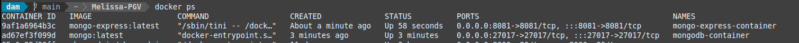


Podemos observar ambos contenedores, con `MongoDB` en el puerto `27017` y `Mongo Express` en el puerto `8081`.

### Verifica los logs de Mongo Express

Verifica los logs de Mongo Express:

```bash
docker logs mongo-express-container
```


Acceder al Cliente Mongo Express
Abre tu navegador y visita:

```bash
localhost:8081
```

> ***Realiza una captura del cliente de bbdd***.

### Prueba la persistencia de BBDD

Accede a MongoDB desde el Cliente
Crea una nueva base de datos llamada `testdb`.

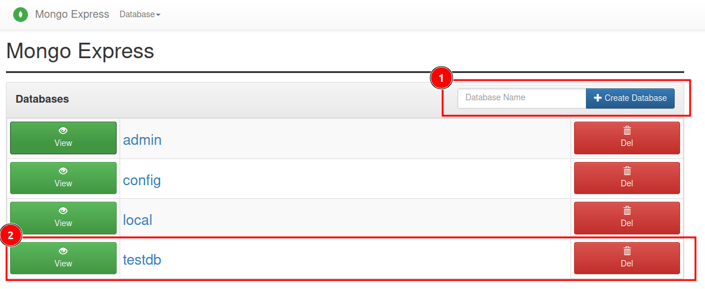

#### Crear la Colección users

Una vez dentro de la base de datos (por ejemplo, exampledb):

- Haz clic en el botón Create.
- Collection (Crear colección). Escribe el nombre de la colección, por ejemplo: `users`.
Haz clic en Create (Crear).


#### Añadir Documentos a la Colección users

- Abre la colección users.
- Haz clic en Add Document (Añadir documento).
- Escribe un documento JSON, por ejemplo:

```json
{
    "name": "John Doe",
    "email": "john@example.com",
    "age": 30
}
```

Haz clic en Save (Guardar) para guardar el documento.

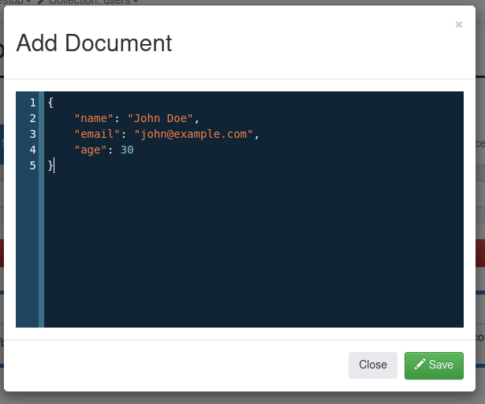

#### Verificación

##### Visualmente

> ***Verifica visualmente y a través de una captura de pantalla la creación correcta de la bbdd y de la colección***.

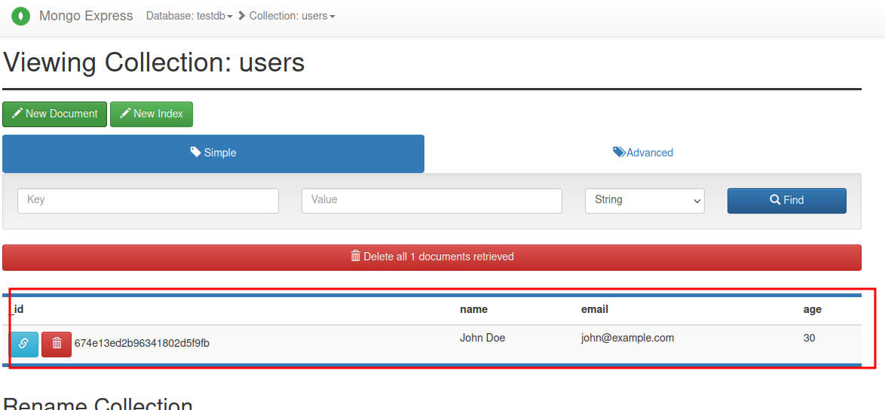

##### Red

Lanza el diagnóstico de red a través del siguiente comando.

```bash
docker network inspect mongodb-network
```

##### Conectividad con la BBDD

Realiza la verificación con la BBDD. Lanza el siguiente comando:

```bash
docker exec -it mongodb-container mongosh -u admin -p admin123
```

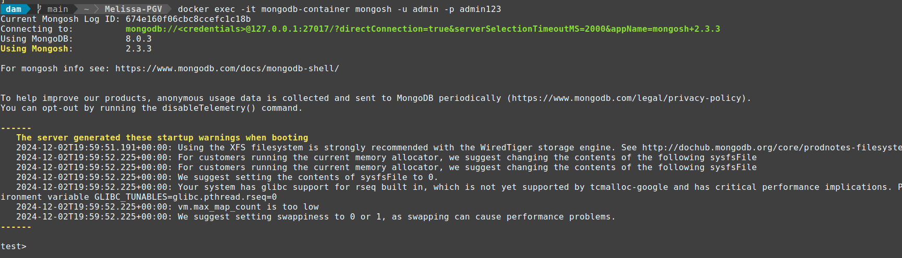

Utiliza la bbdd `testdb`:

```bash
use testdb
```

Lista las colecciones que tienes disponibles:

```bash
show collections
```

Añade un nuevo documento a la colección:

```bash
db.users.insertOne({
    name: "Pepe",
    email: "quiero-ser-como-pepe@example.com",
    age: 65
})
```

Muestra los valores almacenados:

```bash
db.users.find()
```

>***Accede al navegador y verifica el estado de la colección***.

La forma de salir es ejecutando `exit`.

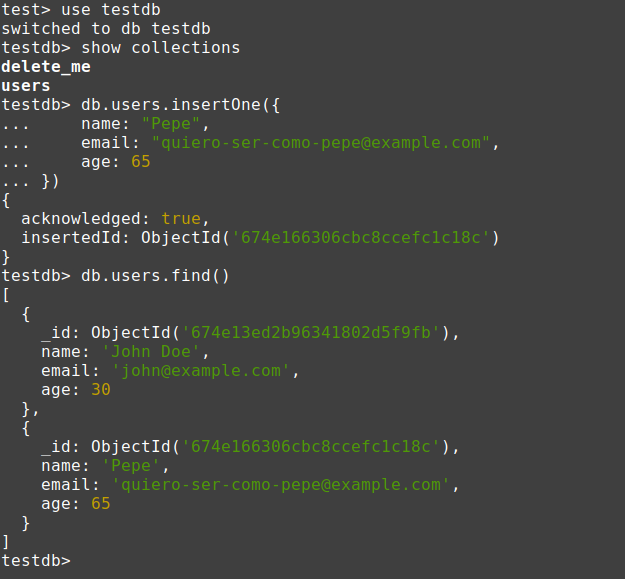
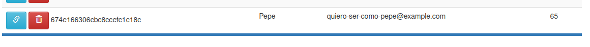

## **Detener y eliminar contenedores**

Cuando termines de trabajar con MongoDB, puedes detener y eliminar el contenedor con los siguientes comandos:

```bash
docker stop <nombre-contenedor>
```

> Para eliminar un contenedor
>
>```bash
>docker rm <nombre-contenedor>
>```

Eliminamos 
```bash
 dam   main  ~  Melissa-PGV  docker stop 9af1a6964b3c 
9af1a6964b3c
 dam   main  ~  Melissa-PGV  docker rm 9af1a6964b3c
9af1a6964b3c

```


