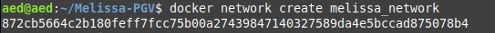
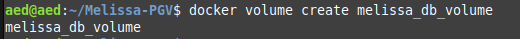
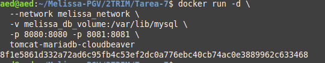
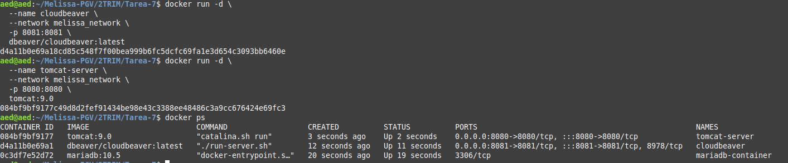

# Configuración de un Entorno Docker con Tomcat, MariaDB y CloudBeaver

Este proyecto crea un entorno Docker con un servidor Tomcat, una base de datos MariaDB y un cliente de administración CloudBeaver. Se incluyen redes personalizadas y un volumen común para persistir datos.

---

## **Requisitos Previos**

1. Docker instalado en tu máquina. Verifica la instalación con:
   ```bash
   docker --version
   docker ps
   ```

2. Archivos necesarios:
   - `Dockerfile`: Configuración para construir la imagen.
   - `sample.war`: Archivo WAR de ejemplo para desplegar en Tomcat.

---

## **Pasos para la Configuración**

### **1. Crear la Red Docker Personalizada**

Ejecuta el siguiente comando para crear una red compartida:

```bash
docker network create melissa_network
```



### **2. Crear un Volumen Docker**

Crea un volumen para persistir los datos de MariaDB:

```bash
docker volume create melissa_db_volume
```


### **3. Crear y Configurar el Dockerfile**

Crea un archivo `Dockerfile` en el directorio raíz del proyecto con el siguiente contenido:

```dockerfile
# Imagen base para MariaDB
FROM mariadb:10.5 as mariadb_base

# Configuración de MariaDB
ENV MYSQL_ROOT_PASSWORD=root
ENV MYSQL_DATABASE=exampledb
VOLUME /var/lib/mysql

# Imagen base para Tomcat
FROM tomcat:9.0 as tomcat_base

# Copiar una aplicación de ejemplo al directorio webapps de Tomcat
COPY ./sample.war /usr/local/tomcat/webapps/

# Imagen base para CloudBeaver
FROM dbeaver/cloudbeaver:latest as cloudbeaver_base

# Imagen final que integra los servicios
FROM ubuntu:20.04

# Instalar herramientas esenciales
RUN apt-get update && apt-get install -y \
    wget \
    curl \
    mysql-client \
    && apt-get clean

# Copiar configuraciones de MariaDB
COPY --from=mariadb_base / /mariadb/

# Copiar configuraciones de Tomcat
COPY --from=tomcat_base / /tomcat/

# Copiar configuraciones de CloudBeaver
COPY --from=cloudbeaver_base / /cloudbeaver/

# Exponer puertos
EXPOSE 8080 8081

# Comando para ejecutar todos los servicios
CMD bash -c "service mysql start && /usr/local/tomcat/bin/catalina.sh run & /opt/cloudbeaver/cloudbeaver & wait"
```

### **4. Construir la Imagen**

Construye la imagen Docker ejecutando:

```bash
docker build -t tomcat-mariadb-cloudbeaver .
```

Importante tener un sample.war, si no ejecutamos antes:
```bash
wget https://tomcat.apache.org/tomcat-9.0-doc/appdev/sample/sample.war
```

### **5. Ejecutar el Contenedor**

Inicia un contenedor basado en la imagen creada:

```bash
docker run -d \
  --network my_network \
  -v my_db_volume:/var/lib/mysql \
  -p 8080:8080 -p 8081:8081 \
  tomcat-mariadb-cloudbeaver
```


Comprobamos que esté ejecutado los tres contenedores


### **6. Verificar los Servicios**

- **MariaDB**: Conéctate usando el cliente MySQL:
  ```bash
  mysql -h <container_ip> -u root -p
  ```
  NOTA: Para saber la ip podemos usar

  ```
  docker inspect -f '{{range .NetworkSettings.Networks}}{{.IPAddress}}{{end}}' mariadb-container
  ```

- **Tomcat**: Accede a [http://localhost:8080](http://localhost:8080) en tu navegador.

- **CloudBeaver**: Accede a [http://localhost:8081](http://localhost:8081) para gestionar la base de datos.

---

## **Detener y Eliminar Contenedores**

### Detener el Contenedor

```bash
docker stop <nombre_contenedor>
```

### Eliminar el Contenedor

```bash
docker rm <nombre_contenedor>
```

### Limpiar Recursos No Usados

```bash
docker system prune -a
```

---


